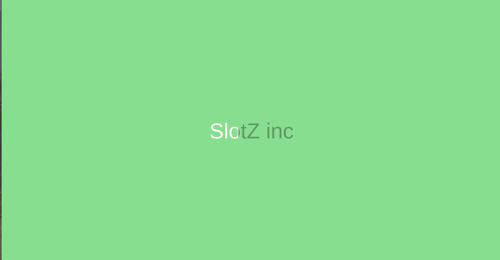
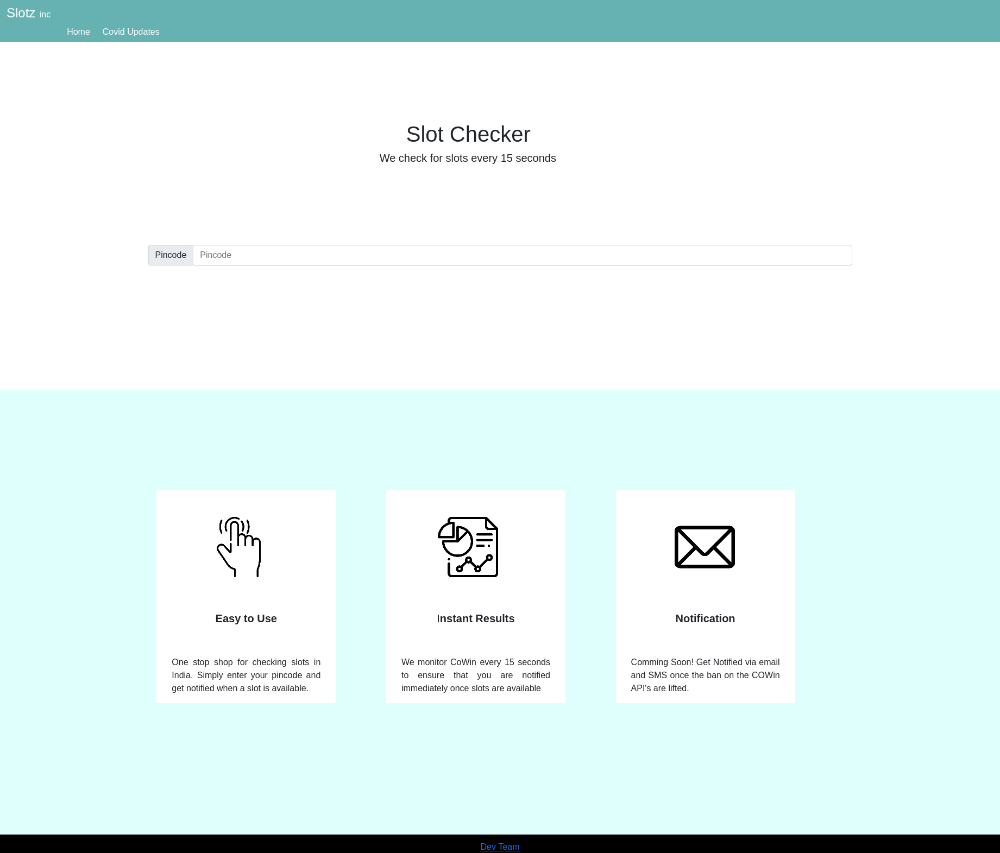
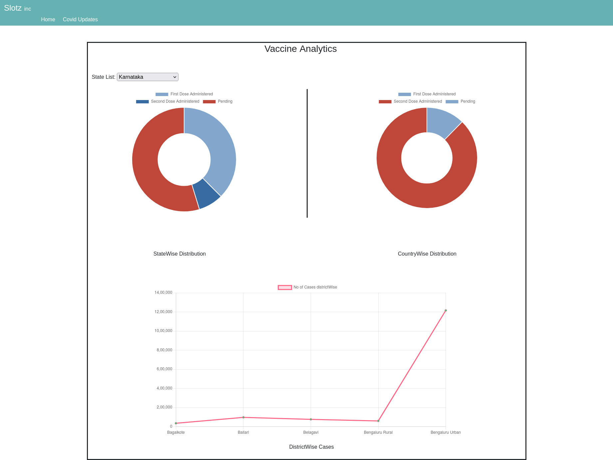

# Introduction

It has become really difficult to find slots on CoWin(Indian Covid Vaccination registration platform). This website pings the CoWin API's periodically to fetch slot information and alert the user once slots are available. Additionally, the analytics page shows the current covid situation in India.

# Deployment

The website is deployed using Netlify with the following URL: https://cowinslotz.netlify.app/  
  
Alternatively,   

Install docker on your system and run the following commands:
     
     
    1. Create the image:  
      `  sudo docker build -t cowinapp:dev . `  
     
    2. Run the image on a local container:  
`  sudo docker run -p 1003:80 cowinapp:dev `  
     
Your application will run locally on localhost:1003  

Well...

If you just want to run the webApp on your local host:  
1. Clone the repo  
2. install node,npm and angular CLI then run:  
   ` npm install `  
    
3. ng serve  

Be careful! This will run the application in a development server.  

# Workflow

1. User enters the pincode of his area and keeps the website open on a tab in his browser.
2. The website periodically pings the CoWin API's to fetch slot updates.
3. Once slots are found a notification sound alerts the user about the availability of slots and the address of the locations where the slots are available.

# Screenshot
  
  
  

# Future plans  

1. Add load balancers and deploy the webApp on AWS.
2. Add caching mechanism.

# References

1. All icons are sourced from: https://www.freepik.com/
2. Netlify docs
