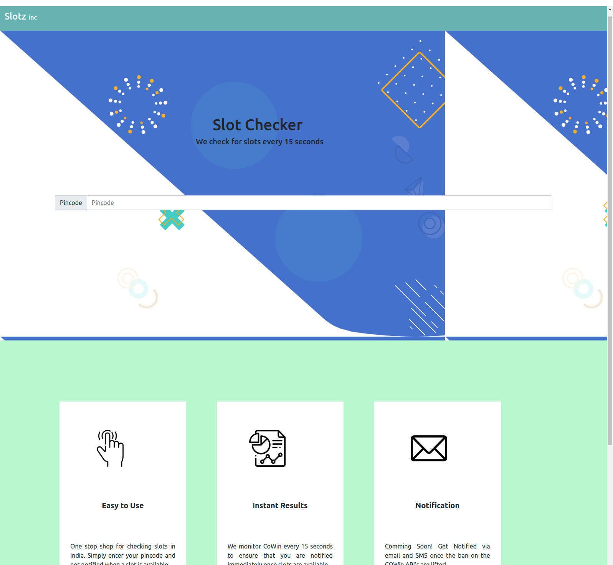

# Introduction

It has become really difficult to find slots on CoWin(Indian Covid Vaccination registration platform). This website pings the CoWin API's periodically to fetch slot information and directly alert the user once slots are available.

# Deployment

The website is deployed using Netlify with the following URL: https://cowinslotz.netlify.app/

# Workflow

1. User enters the pincode of his area and keeps the website open on a tab in his browser.
2. The website periodically pings the CoWin API's to fetch slot updates.
3. Once slots are found a notification sound alerts the user about the availability of slots and the address of the locations where the slots are available.

# Screenshot

# Future plans  

1. Add load balancers and deploy the webApp on AWS.
2. Add caching mechanism.

# References

1. All icons are sourced from: https://www.freepik.com/
2. Netlify docs
